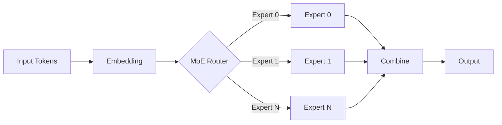

# Hello World

这是一篇示例文章，用来验证博客支持的功能。

## 代码块（带行号、高亮、复制）

```python
import torch
import torch_npu
from torch.distributed.fsdp import fully_shard

def setup_fsdp(model, device_mesh):
    for layer in model.layers:
        fully_shard(layer, mesh=device_mesh)
    fully_shard(model, mesh=device_mesh)
    return model
```

也支持行高亮：

```python{2,4-5}
def _grouped_mm_fallback(x, weights, group_sizes):
    offsets = torch.cumsum(group_sizes, dim=0, dtype=torch.int32)
    outputs = []
    for i, end in enumerate(offsets):
        start = offsets[i - 1] if i > 0 else 0
        outputs.append(x[start:end] @ weights[i])
    return torch.cat(outputs, dim=0)
```

## 数学公式

行内公式：FSDP 把参数 $\theta$ 切到 $N$ 个 device 上，每个 rank 持有 $\theta / N$。

块级公式：

$$
\mathcal{L}_{\text{CP}} = \frac{1}{N_{\text{cp}}} \sum_{i=1}^{N_{\text{cp}}} \mathcal{L}_i
$$

## Mermaid 图



## 提示框

::: tip 提示
这是一个 tip 容器，适合放小贴士。
:::

::: warning 注意
这是一个 warning，适合放注意事项。
:::

::: danger 危险
这是一个 danger，适合放严重警告。
:::

::: details 点击查看详情
这里可以放可折叠的长内容，比如完整的报错堆栈。
:::

## 表格

| 框架 | 并行支持 | NPU 适配 |
|---|---|---|
| LLaMA-Factory | FSDP / DDP | 部分 |
| HyperParallel | FSDP2 + CP + TP | 原生 |
| Transformers | Accelerate 集成 | 通过 torch_npu |
